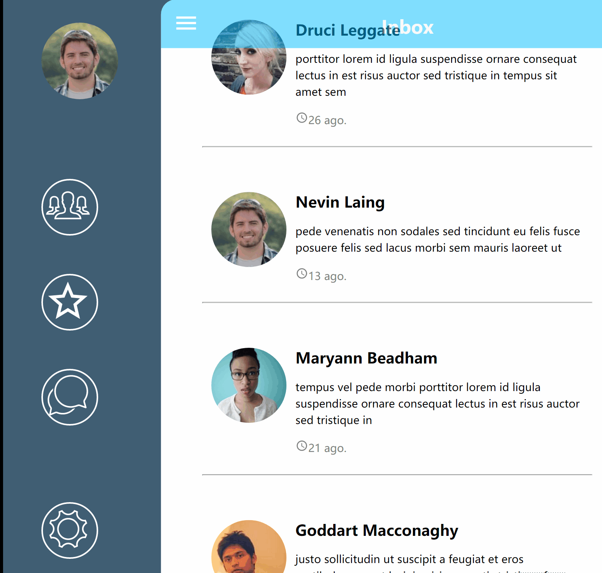

# Menu_demo
This is the web application demo for the left siding menu by using react.js




## Installation

Because this application is built by react.js, you need to install node.js on your computer first.
```
$npm install
$npm run start 
```
Runs the app in development mode.
Open http://localhost:3000 to view it in the browser.


